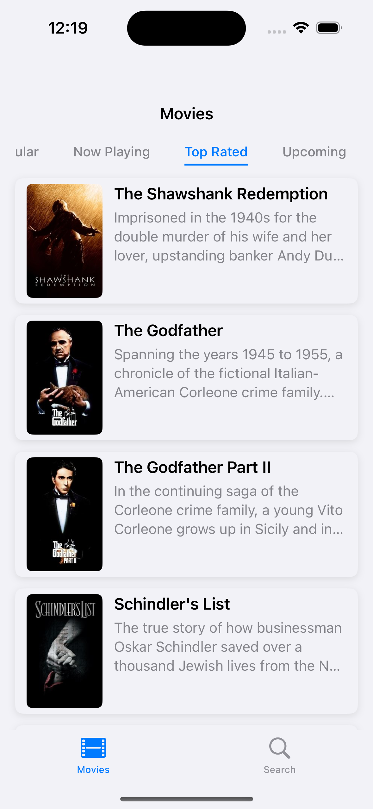
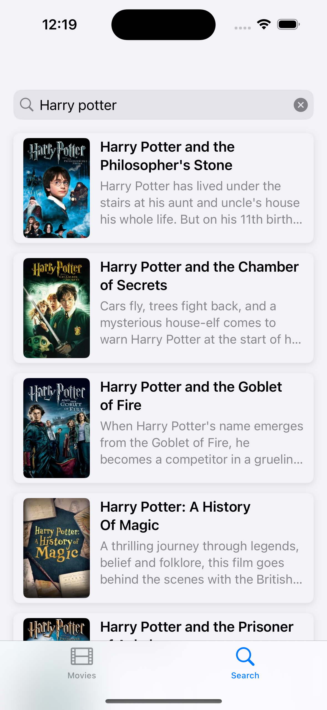
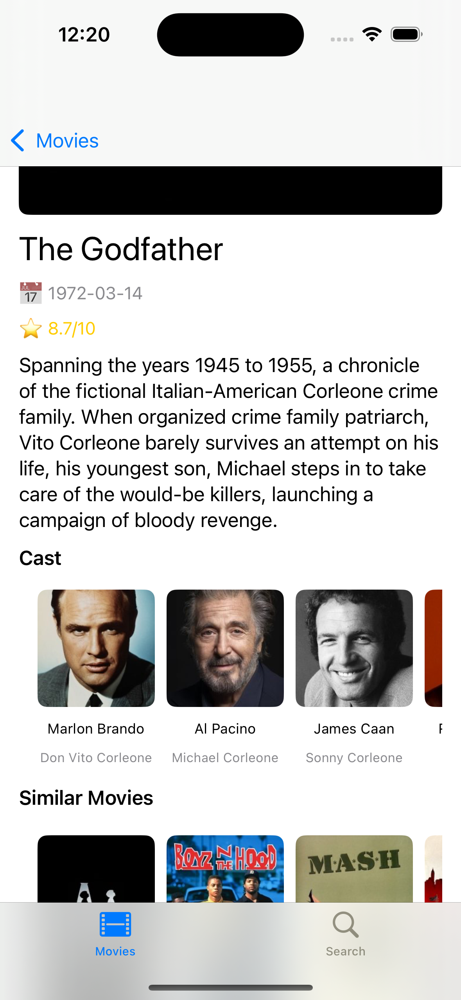
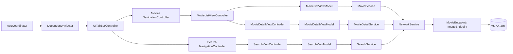

# TheMovieDB-MVVM

An iOS application built with Swift using the **MVVM-C architecture** that fetches movie data from [The Movie Database (TMDB)](https://www.themoviedb.org/) API.
The project demonstrates modern iOS development practices such as the Coordinator pattern, Dependency Injection, async/await, protocol-oriented design, and clean architecture principles.

---

## 📸 Screenshots

<p align="center">
  
  
  
</p>

---

## 🚀 Getting Started

### 1. Clone the Repository

```bash
git clone https://github.com/emrekr/TheMovieDB-MVVM.git
cd TheMovieDB-MVVM
```

### 2. Create `Secrets.plist`

This project uses a `Secrets.plist` file to store the TMDB API **Access Token** securely.
Since this file is **ignored via `.gitignore`**, you need to create it manually:

1. In the **`TheMovieDB-MVVM/Resources`** directory, create a new file: **Property List** → `Secrets.plist`
2. Add the following key/value pair:

   * **Key:** `TMDBAccessToken`
   * **Type:** String
   * **Value:** Your TMDB API Bearer token (from your TMDB account settings)
3. Make sure the file is added to the app target.

Example:

```xml
<?xml version="1.0" encoding="UTF-8"?>
<!DOCTYPE plist PUBLIC "-//Apple//DTD PLIST 1.0//EN" 
    "http://www.apple.com/DTDs/PropertyList-1.0.dtd">
<plist version="1.0">
<dict>
    <key>TMDBAccessToken</key>
    <string>YOUR_ACCESS_TOKEN_HERE</string>
</dict>
</plist>
```

> 🔒 **Do not** commit this file to source control. Ensure `.gitignore` contains:

```
TheMovieDB-MVVM/Resources/Secrets.plist
```

---

## 🏗 Architecture

This project follows the **MVVM-C** (Model-View-ViewModel with Coordinator) pattern:

```
Coordinator → Dependency Injection → TabBarController → ViewControllers → ViewModel → Service → Network Layer
```

**Layers:**

* **Coordinator:** Handles navigation flow
* **Dependency Injection:** Creates and injects dependencies
* **ViewModel:** Contains presentation logic and interacts with Services
* **Service Layer:** Handles business logic and network requests
* **Network Layer:** Generic API client using `Endpoint` protocols
* **ImageLoader:** Async image loading with in-memory caching
* **Strategy Pattern:** Handles multiple movie list types dynamically (Popular, Now Playing, Top Rated, Upcoming)
* **TabBarController:** Hosts multiple app sections (Movies, Search)

---

## 🖼 Architecture Diagram



---

## ✨ Features

* **MVVM-C architecture** with protocol-oriented ViewModels
* **Coordinator pattern** for navigation
* **Dependency Injection** for modular design
* **TabBarController** integration for multiple sections:

  * **Movies tab** with Strategy Pattern and category selection
  * **Search tab** for searching movies by title
* **Type-safe networking** with `Endpoint` protocol & `NetworkService`
* **Async/Await** for clean asynchronous code
* **ImageLoader** with caching support
* **Strategy Pattern** for dynamic movie list selection
* **Custom CollectionView Menu** for category selection
* **Pagination (infinite scroll)**
* **Pull-to-refresh**
* **Loading indicators** for initial and paginated loads
* **Reusable UI Components** (`CardCell`, `MovieCell`, `MovieListCategoryCell`)
* **Minimal storyboard usage** (Launch Screen only)
* **Shared delegate** (`MovieSelectionDelegate`) for navigation from both tabs to Movie Detail

---

## 🎯 Dynamic Movie Lists with Strategy Pattern

The **Strategy Pattern** is used to dynamically change the list type:

* Each strategy defines:

  * A localized title (for the UI)
  * The TMDB API endpoint for that list
* ViewModel receives a list of strategies from `DependencyInjector`
* UI selection changes the active strategy and triggers a new fetch

---

## 🎨 CollectionView Menu for List Selection

A **custom horizontal CollectionView menu** is used for selecting movie categories:

* **`MovieListCategoryCell`** for custom styled category items
* Selected category has a colored underline and highlighted text
* Supports horizontal scrolling for long or localized titles
* Automatically selects the first category on launch

---

## 🔍 Search Feature

The **Search** tab allows searching movies via TMDB's `/search/movie` endpoint.

### Features

* **Real-time search with debounce**: Searches only after the user stops typing for 0.5 seconds
* **Infinite scroll**: Loads more results as the user scrolls
* **Clear on empty**: Clears results instantly when the search bar is emptied
* **Dismiss keyboard on scroll**
* **Coordinator integration**: Selecting a search result opens Movie Detail screen
* **Shared delegate**: Uses `MovieSelectionDelegate` for both Movie List and Search modules
* **Separation of concerns**: ViewControllers only report the selected movie & tab source, Coordinator handles navigation

---

## 🎬 Movie Detail Screen

The **Movie Detail** module displays rich information about a selected movie, including its metadata, cast, similar movies, and trailer link.

### Features

* **MVVM-C compliant structure** with clean separation between ViewModel and ViewController
* Fetches all movie-related data concurrently:

  * Movie detail
  * Credits (cast)
  * Similar movies
  * Videos (trailers)
* YouTube trailer is extracted and presented as a tappable link
* Cast and similar movies are displayed in horizontally scrolling `UICollectionView`s
* Poster image is loaded dynamically and its height is adjusted based on the image aspect ratio
* Modular CollectionView creation with a reusable factory method
* Trailer button is shown only if a valid trailer URL exists

---

## 🌍 Localization & Dynamic API Language

The project uses **String Catalog (`.xcstrings`)** for managing translations.
Supports **English** and **Turkish** for the UI.
API requests are localized based on device language (`"tr-TR"` for Turkish, `"en-US"` for others).

---

## 🛠 Requirements

* iOS 15.0+
* Swift 5.7+
* Xcode 14+

---

## 📦 Installation

1. Clone the repository
2. Create `Secrets.plist` with your TMDB access token
3. Open `.xcodeproj` in Xcode
4. Build and run

---

## 📜 License

This project is licensed under the MIT License.

