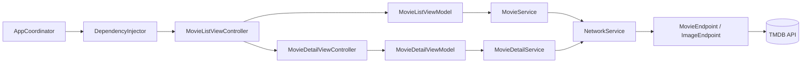

# TheMovieDB-MVVM

An iOS application built with Swift using the **MVVM-C architecture** that fetches movie data from [The Movie Database (TMDB)](https://www.themoviedb.org/) API.  
The project demonstrates modern iOS development practices such as the Coordinator pattern, Dependency Injection, async/await, protocol-oriented design, and clean architecture principles.

---

## 🚀 Getting Started

### 1. Clone the Repository
```bash
git clone https://github.com/emrekr/TheMovieDB-MVVM.git
cd TheMovieDB-MVVM
````

### 2. Create `Secrets.plist`

This project uses a `Secrets.plist` file to store the TMDB API **Access Token** securely.
Since this file is **ignored via `.gitignore`**, you need to create it manually:

1. In the **`TheMovieDB-MVVM/Resources`** directory, create a new file: **Property List** → `Secrets.plist`
2. Add the following key/value pair:

   * **Key:** `TMDBAccessToken`
   * **Type:** String
   * **Value:** Your TMDB API Bearer token (from your TMDB account settings)
3. Make sure the file is added to the app target.

Example:

```xml
<?xml version="1.0" encoding="UTF-8"?>
<!DOCTYPE plist PUBLIC "-//Apple//DTD PLIST 1.0//EN" 
    "http://www.apple.com/DTDs/PropertyList-1.0.dtd">
<plist version="1.0">
<dict>
    <key>TMDBAccessToken</key>
    <string>YOUR_ACCESS_TOKEN_HERE</string>
</dict>
</plist>
```

> 🔒 **Do not** commit this file to source control. Ensure `.gitignore` contains:

```
TheMovieDB-MVVM/Resources/Secrets.plist
```

---

## 🏗 Architecture

This project follows the **MVVM-C** (Model-View-ViewModel with Coordinator) pattern:

```
Coordinator → Dependency Injection → ViewController → ViewModel → Service → Network Layer
```

**Layers:**

* **Coordinator:** Handles navigation flow
* **Dependency Injection:** Creates and injects dependencies
* **ViewModel:** Contains presentation logic and interacts with Services
* **Service Layer:** Handles business logic and network requests
* **Network Layer:** Generic API client using `Endpoint` protocols
* **ImageLoader:** Async image loading with in-memory caching
* **Strategy Pattern:** Handles multiple movie list types dynamically (Popular, Now Playing, Top Rated, Upcoming)

---

## 🖼 Architecture Diagram



---

## ✨ Features

* **MVVM-C architecture** with protocol-oriented ViewModels
* **Coordinator pattern** for navigation
* **Dependency Injection** for modular design
* **Type-safe networking** with `Endpoint` protocol & `NetworkService`
* **Async/Await** for clean asynchronous code
* **ImageLoader** with caching support
* **Strategy Pattern** for dynamic movie list selection

  * Supports **Popular**, **Now Playing**, **Top Rated**, **Upcoming**
  * Easily extendable for new categories
* **Custom CollectionView Menu** for list category selection

  * Replaces UISegmentedControl for more flexibility
  * Horizontal scroll, custom styling, and selection underline
* **Pagination (infinite scroll)**
* **Pull-to-refresh**
* **Loading indicators** for initial and paginated loads
* **Reusable UI Components** (`CardCell`, `MovieCell`, `MovieListCategoryCell`)
* **Minimal storyboard usage** (Launch Screen only)

---

## 📂 Folder Structure

```
TheMovieDB-MVVM/
│
├── TheMovieDB-MVVM
│   ├── App/                      # App lifecycle & main coordinator
│   ├── DependencyInjection/       # Centralized dependency creation
│   ├── Models/                    # Data models
│   ├── Networking/                # Networking layer
│   │   └── Endpoint/
│   ├── Resources/                 # Configs, assets, and localizations
│   ├── Services/                   # Business logic
│   ├── ViewModels/                 # ViewModel layer
│   │   └── Strategies/             # Movie list strategies for Strategy Pattern
│   └── Views/                      # UI components
│       ├── CardCell.swift
│       ├── MovieCell.swift
│       ├── MovieListViewController.swift
│       └── MovieListCategoryCell.swift
│
└── Tests & UITests
```

---

## 🎬 Movie Detail Feature

The project includes a fully functional **Movie Detail** module.

### Features

* **Dedicated Service**: `MovieDetailService` handles fetching a single movie’s details via the `/movie/{id}` TMDB API endpoint.
* **Dynamic UI**: Poster, title, release date, vote average, and overview in a scrollable layout.
* **ImageLoader Integration**: Asynchronous poster loading with caching.
* **Dynamic Aspect Ratio**: Poster height calculated based on actual image size.
* **Coordinator Navigation**: Selection from the list navigates to detail view.
* **Dependency Injection**: Managed through `DependencyInjector`.

---

## 🎯 Dynamic Movie Lists with Strategy Pattern

The **Strategy Pattern** is used to dynamically change the list type:

* Each strategy defines:

  * A localized title (for the UI)
  * The TMDB API endpoint for that list
* ViewModel receives a list of strategies from `DependencyInjector`
* UI selection changes the active strategy and triggers a new fetch

Example strategies:

* `PopularMoviesStrategy`
* `NowPlayingMoviesStrategy`
* `TopRatedMoviesStrategy`
* `UpcomingMoviesStrategy`

---

## 🎨 CollectionView Menu for List Selection

A **custom horizontal CollectionView menu** is used for selecting movie categories:

* **`MovieListCategoryCell`** for custom styled category items
* Selected category has a colored underline and highlighted text
* Supports horizontal scrolling for long or localized titles
* Automatically selects the first category on launch

---

## 🌍 Localization & Dynamic API Language

The project uses **String Catalog (`.xcstrings`)** for managing translations.
Supports **English** and **Turkish** for the UI.
API requests are localized based on device language (`"tr-TR"` for Turkish, `"en-US"` for others).

---

## 🛠 Requirements

* iOS 15.0+
* Swift 5.7+
* Xcode 14+

---

## 📦 Installation

1. Clone the repository
2. Create `Secrets.plist` with your TMDB access token
3. Open `.xcodeproj` in Xcode
4. Build and run

---

## 📜 License

This project is licensed under the MIT License.


