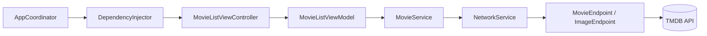
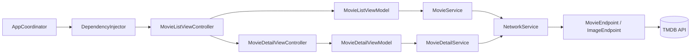

# TheMovieDB-MVVM

An iOS application built with Swift using the **MVVM-C architecture** that fetches movie data from [The Movie Database (TMDB)](https://www.themoviedb.org/) API.  
The project demonstrates modern iOS development practices such as the Coordinator pattern, Dependency Injection, async/await, protocol-oriented design, and clean architecture principles.

---

## 🚀 Getting Started

### 1. Clone the Repository
```bash
git clone https://github.com/emrekr/TheMovieDB-MVVM.git
cd TheMovieDB-MVVM
```

### 2. Create `Secrets.plist`
This project uses a `Secrets.plist` file to store the TMDB API **Access Token** securely.  
Since this file is **ignored via `.gitignore`**, you need to create it manually:

1. In the **`TheMovieDB-MVVM/Resources`** directory, create a new file: **Property List** → `Secrets.plist`
2. Add the following key/value pair:
    - **Key:** `TMDBAccessToken`  
    - **Type:** String  
    - **Value:** Your TMDB API Bearer token (from your TMDB account settings)
3. Make sure the file is added to the app target.

Example:
```xml
<?xml version="1.0" encoding="UTF-8"?>
<!DOCTYPE plist PUBLIC "-//Apple//DTD PLIST 1.0//EN" 
    "http://www.apple.com/DTDs/PropertyList-1.0.dtd">
<plist version="1.0">
<dict>
    <key>TMDBAccessToken</key>
    <string>YOUR_ACCESS_TOKEN_HERE</string>
</dict>
</plist>
```

> 🔒 **Do not** commit this file to source control. Ensure `.gitignore` contains:
```
TheMovieDB-MVVM/Resources/Secrets.plist
```

---

## 🏗 Architecture

This project follows the **MVVM-C** (Model-View-ViewModel with Coordinator) pattern:

```
Coordinator → Dependency Injection → ViewController → ViewModel → Service → Network Layer
```

**Layers:**
- **Coordinator:** Handles navigation flow
- **Dependency Injection:** Creates and injects dependencies
- **ViewModel:** Contains presentation logic and interacts with Services
- **Service Layer:** Handles business logic and network requests
- **Network Layer:** Generic API client using `Endpoint` protocols
- **ImageLoader:** Async image loading with in-memory caching

---

## 🖼 Architecture Diagram



---

## ✨ Features

- **MVVM-C architecture** with protocol-oriented ViewModels
- **Coordinator pattern** for navigation
- **Dependency Injection** for modular design
- **Type-safe networking** with `Endpoint` protocol & `NetworkService`
- **Async/Await** for clean asynchronous code
- **ImageLoader** with caching support
- **Pagination (infinite scroll)**
- **Pull-to-refresh**
- **Loading indicators** for initial and paginated loads
- **Reusable UI Components** (`CardCell`, `MovieCell`)
- **Minimal storyboard usage** (Launch Screen only)

---

## 📂 Folder Structure

```
TheMovieDB-MVVM/
│
├── TheMovieDB-MVVM
│   ├── App/                      # App lifecycle & main coordinator
│   │   ├── AppCoordinator.swift
│   │   ├── AppDelegate.swift
│   │   └── SceneDelegate.swift
│   │
│   ├── Base.lproj/                # Launch screen storyboard
│   │   └── LaunchScreen.storyboard
│   │
│   ├── DependencyInjection/       # Centralized dependency creation
│   │   └── DependencyInjector.swift
│   │
│   ├── Models/                    # Data models
│   │   ├── Movie.swift
│   │   └── MovieResponse.swift
│   │
│   ├── Networking/                # Networking layer
│   │   ├── APIError.swift
│   │   ├── HTTPMethod.swift
│   │   ├── NetworkService.swift
│   │   ├── NetworkServiceProtocol.swift
│   │   └── Endpoint/
│   │       ├── Endpoint.swift
│   │       ├── ImageEndpoint.swift
│   │       └── MovieEndpoint.swift
│   │
│   ├── Resources/                 # Configs, assets, and localizations
│   │   ├── APIConfig.swift
│   │   ├── Assets.xcassets/
│   │   ├── Localizable.xcstrings
│   │   └── Secrets.plist (ignored)
│   │
│   ├── Services/                   # Business logic
│   │   ├── ImageLoader.swift
│   │   └── MovieService.swift
│   │
│   ├── ViewModels/                 # ViewModel layer
│   │   └── MovieListViewModel.swift
│   │
│   └── Views/                      # UI components
│       ├── CardCell.swift
│       ├── MovieCell.swift
│       └── MovieListViewController.swift
│
├── TheMovieDB-MVVM.xcodeproj/      # Xcode project files
│
├── TheMovieDB-MVVMTests/           # Unit tests
│   └── TheMovieDB_MVVMTests.swift
│
└── TheMovieDB-MVVMUITests/         # UI tests
    ├── TheMovieDB_MVVMUITests.swift
    └── TheMovieDB_MVVMUITestsLaunchTests.swift
```

---

## 🎬 Movie Detail Feature

The project now includes a fully functional **Movie Detail** module, built following MVVM-C principles.

### Features
- **Dedicated Service**: `MovieDetailService` handles fetching a single movie’s details via the `/movie/{id}` TMDB API endpoint.
- **Dynamic UI**: Displays the movie poster, title, release date, vote average, and overview in a scrollable view.
- **ImageLoader Integration**: Poster images are loaded asynchronously with caching, using the same loader as in the movie list.
- **Dynamic Aspect Ratio**: Poster height is calculated at runtime based on the actual image size to avoid empty spaces with `scaleAspectFit`.
- **Coordinator Navigation**: Selecting a movie from the list triggers navigation to the detail screen via the `AppCoordinator`.
- **Dependency Injection**: `MovieDetailViewModel` and `MovieDetailService` instances are created via the `DependencyInjector`.

### Architecture Diagram (Updated)


### Example UI
- **Poster**: Large top image with dynamic height
- **Title**: Large bold font
- **Release Date**: Secondary label with calendar icon
- **Vote Average**: Yellow star rating
- **Overview**: Multi-line description text
- **Scroll Support**: Entire content scrollable for long overviews

---

## 🌍 Localization & Dynamic API Language

The project uses **String Catalog (`.xcstrings`)** for managing translations.  
Currently supports **English** and **Turkish** for the UI.  
API requests to TMDB are also localized based on the device language:

- If the device language is **Turkish**, API requests use `"tr-TR"`.
- For all other languages, API requests default to `"en-US"`.

**Example:**

```json
{
  "sourceLanguage" : "en",
  "strings" : {
    "movies.title" : {
      "comment" : "Title for movies list screen",
      "localizations" : {
        "en" : { "stringUnit" : { "value" : "Movies" } },
        "tr" : { "stringUnit" : { "value" : "Filmler" } }
      }
    }
  },
  "version" : "1.0"
}
```

---

## 🛠 Requirements

- iOS 15.0+
- Swift 5.7+
- Xcode 14+

---

## 📦 Installation

1. Clone the repository
2. Create `Secrets.plist` with your TMDB access token
3. Open `.xcodeproj` in Xcode
4. Build and run on simulator or device

---

## 📜 License

This project is licensed under the MIT License.

